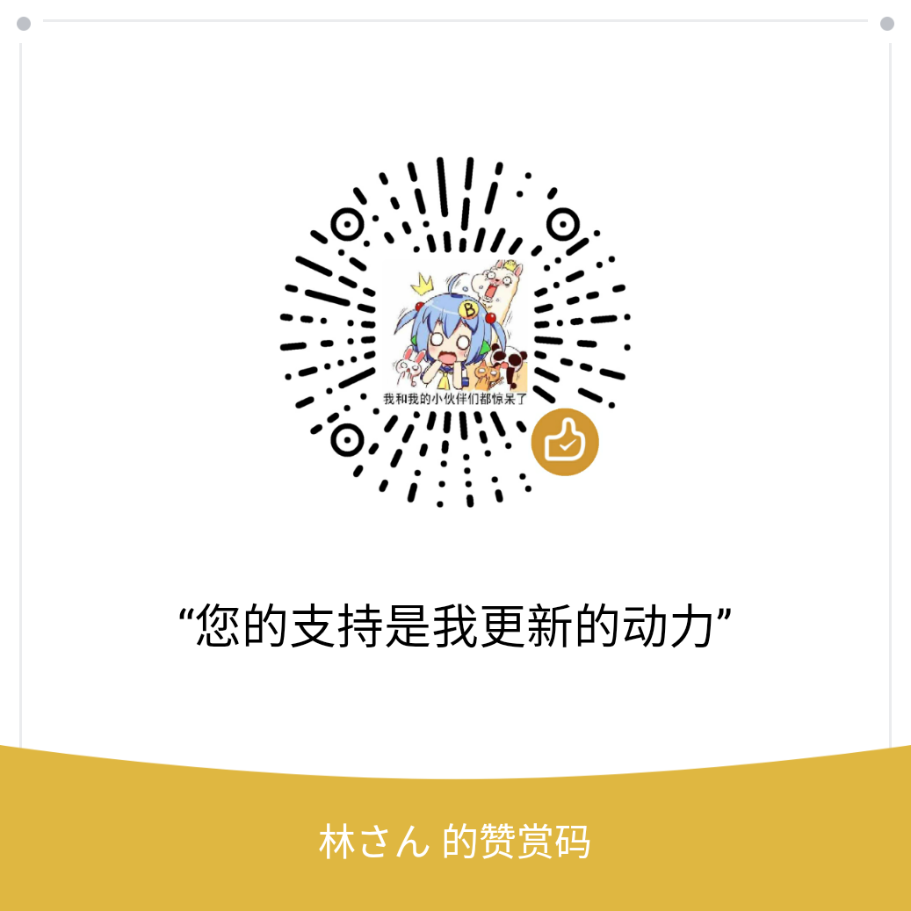

# 我的听书

一款自用的安卓听书app

咱平时没事干的时候喜欢听书打发时间，但是`懒人听书`和`喜马拉雅`都开始收费了。某天发现听书界也有不少类似小说界`笔趣阁`的网站。不过听书不像看小说，在网页端用浏览器打开音频播放体验很差，于是就有了这一款 app。

目前核心的播放功能已完成，UI方面不是强项，有兴趣的朋友欢迎帮忙 PR 改进。

bug反馈或者功能建议可加 QQ 群：470339586

## 下载

* [Release](https://github.com/eprendre/tingshu/releases)
* [Play Store](https://play.google.com/store/apps/details?id=com.github.eprendre.tingshu)

## 已支持的站点

* 幻听网：[http://m.ting89.com](http://m.ting89.com)
* 520听书网：[http://m.520tingshu.com](http://m.520tingshu.com)
* 56听书网：[http://m.ting56.com](http://m.ting56.com)
* 静听网：[http://m.audio699.com](http://m.audio699.com)
* 听书宝：[https://www.tingshubao.com](https://www.tingshubao.com)
* TingChina：[http://www.tingchina.com](http://www.tingchina.com)
* 天天评书网：[https://www.pingshu365.com](https://www.pingshu365.com)
* 22听书网：[https://m.ting22.com](https://m.ting22.com)
* 乾坤听书网：[http://m.qktsw.com](http://m.qktsw.com)
* 恋听网：[https://ting55.com](https://ting55.com)
* 我听评书网：[https://m.5tps.com](https://m.5tps.com)
* 听书阁：[http://www.tingshuge.com](http://www.tingshuge.com)(现在挂了，不知道啥时候能好。)

## 注意事项

* 这个 app 只是一个爬虫, 不对书籍是否能够播放的可靠性负责。如果原网站已经失效了, 那些书在 app 里面听不了也很正常。如果所有书都听不了, 那应该是机型的问题。碰到这种的希望大家可以提 issue 告之一下机型以及安卓系统版本。

## 截图

主页 | 播放界面
---------|---------
 | 

## 支持

微信赞赏码 | 支付宝收款码
---------|---------
 | 
